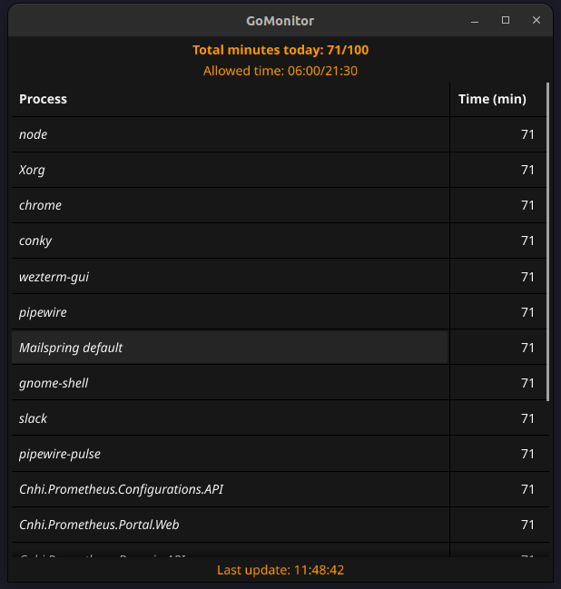

# GoMonitor

Monitor system usage, a sort of parental control (for linux systems).



So, here is the thing:

- I needed a way to avoid having my son turn into a fucking monkey playing Minecraft.
- I tried Timekpr-nExT and it didn't work well.
- I'm impatient and instead of make it work better, I decided to write something myself.
- I suck at programming this stuff, I'm not used to it and I don't have too much time to waste bothering my family.

I needed a few simple stuff:

- Check the total time spent and logout the user when it reaches a limit.
- Have some sort of downtime functionality
- View some statistics about what the user did.

Here comes GoMonitor (which is a really bad piece of software).

Features:

- Check the total time spent and logout the user when it reaches a limit
- Support a downtime functionality, user is logged out when reaches the time window limit
- View some statistics about what the user did

Lol

## Getting started

### Installation

Clone this repo

```
$ git clone git@github.com:abidibo/GoMonitor.git
```

### Configuration

Create the file `/etc/gomonitor.json`. Yes, it's a json file. Yes GoMonitor does not provide a shiny root user interface to configure it.

```
{
  "app": {
    "homePath": "/SOME/PATH/.gomonitor",
    "screenTimeLimitMinutes": {
      "USER": 120,
    },
    "screenTimeWindow": {
      "USER": {
        "start": "07:00",
        "stop": "21:00",
      },
    },
    "screenTimeApi": {
      "OTHER_USER": "https://myapi/gomonitor",
    },
    "logIntervalMinutes": 10,
    "retainPeriodDays": 10
  }
}
```


GoMonitor writes its stuff (db and logs) in the `homePath` directory.

GoMonitor logs out `USER` when it reaches the `screenTimeLimitMinutes`

GoMonitor logs out `USER` if outside of the `screenTimeWindow` (unless `start` equals `stop`)

GoMonitor logs every `logIntervalMinutes` (and uses this interval to aggregate the time spent by the user, so keep it small)

GoMonitor keeps data and logs for `retainPeriodDays` days

Replace `USER` with the user you want to monitor.

You can set a static limits for `screenTimeLimitMinutes` and `screenTimeWindow` or use an API endpoint for `screenTimeApi`, in such case you must return the following json response:

``` json
{
  "screenLimitMin": 120,
  "timeWindowStart": "07:00",
  "timeWindowStop": "21:00"
}
```

Please note the format of `timeWindowStart` and `timeWindowStop`, that should be `HH:MM`.

### Usage

GoMonitor behaves differently when running as root or as normal user. Fact.

GoMonitor has two subcommands available: `monitor` and `stats`

#### Monitor

The monitor subcommand is the boss.

If run as root user, it starts to collect data about all logged user. It writes this data to an sqlite3 database in the `homePath` folder. When a user reaches its limit, it logs him out.
It collects the data every `logIntervalMinutes` minutes, and in particular it records all the processes there were running at that moment (and were wasting at least some memory or cpu).

If run as user it stays awake, displays a system tray icon and notifies the user when it starts, when half of the time limit is reached and when it reaches the time limit. If the user clicks the tray icon, then a super cool dialog appears informing the user about the time spent.


Logs are saved in in `config.app.homePath/gomonitor.log`.

You should make both running at system startup. For example you can add a root crontab entry with the `@reboot` keyword for the root part, and you can just configure it as a startup application for a normal user.

The command is the same:

```
$ ./gomonitor monitor
```

By the way, you can read some help text:
```
$ ./gomonitor -h
$ ./gomonitor monitor -h
$ ./gomonitor stats -h
```

#### Statistics

With the `stats` subcommand you can see some statistics about the user. If run as root you must specify the user and optionally the date (default today). If run as normal user just the date.


```
# ./gomonitor stats -u rufy -d 2023-09-29
# ./gomonitor stats -u rufy
$ ./gomonitor stats -d 2023-09-29
$ ./gomonitor stats
```

## Uninstall

Simply remove your cloned repo and the `config.app.homePath` folder.

## Just to say

I really didn't have time (at the moment) to implement it the right way. There may be concurrency issues because two different processes uses the same log and database, I'm not sure, I should read carefully all the third library documentation, maybe I'll do it. Just keep in mind that.

## TODO
- Better time detection mangement (suspend, hibernate, etc...)
- Better UI
- Better stats
- Maybe add limits per process? 
