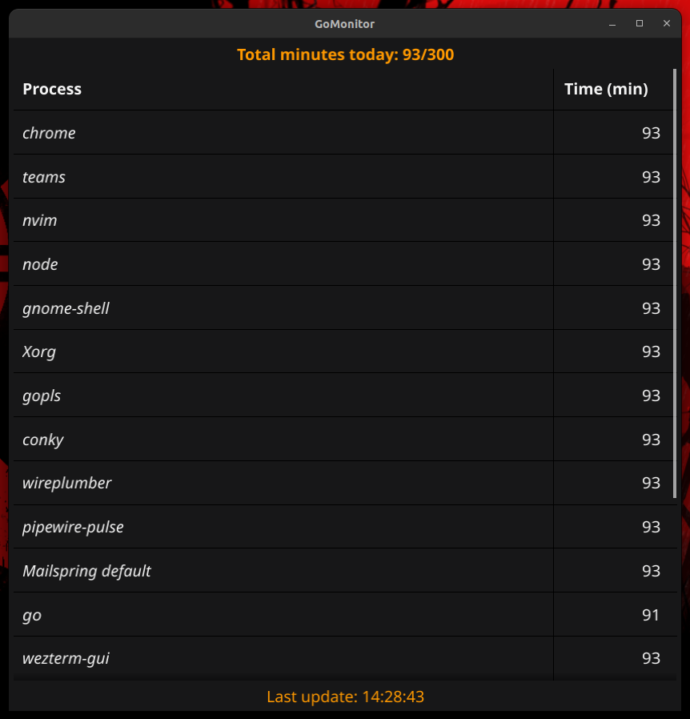

# GoMonitor

Monitor system usage, a sort of parental control.



It logs processes and their time usage.

Logs (total time and processes time) are stored in a sqlite3 db, when time screen limit is reached, the user is logged out form the system.

Provides stats and a super simple interface to view remaining time.

## Getting started

Clone this repo

```
$ git clone git@github.com:abidibo/GoMonitor.git
```

Create the file `/etc/gomonitor.json`

```
{
  "app": {
    "homePath": "/SOME/PATH/.gomonitor",
    "screenTimeLimitMinutes": {
      "USER": 120,
    },
    "logIntervalMinutes": 10
  }
}
```

Replace `USER` with the user you want to monitor.

Every `logIntervalMinutes` minutes, a new log row is created (and the partial time interval is stored), then all active processes in that moment are associated to that log row.
When calculating total time spent for a process, we simply sum up all the partial times of the related log rows.
So this is not super precise, if the system halts in the middle of a log interval, it will not be counted.
For this reason it's better to avoid configuring a big interval.


Run at startup as root to start the monitor:
```
# ./gomonitor monitor
```

Run at startup as user to get notifications:
```
$ ./gomonitor monitor
```

You can view stats for users (if root, otherwise only for the current user) and date:

```
$ ./gomonitor stats -u USER -d 2023-09-25
```

For all available options:
```
$ ./gomonitor -h
```

## How it works

GoMonitor collects system usage data in a sqlite3 database which is saved in `config.app.homePath/gomonitor.db`.

The configuration file is a json which must exists in `/etc/gomonitor.json`.

Logs are saved in in `config.app.homePath/gomonitor.log`.

## How to use it

1. Run `gomonitot monitor` as root user at startup
2. Run `gomonitor monitor` as user at startup

The controlled user will receive notifications about time usage when the application stats, when it reaches half time and when it approximately reaches the time limit.
Also the user will have a system tray icon that when clicked will open a dialog showing the used time.


At any time you can check stats with `gomonitor stats` command


## Uninstall

Simply remove your cloned repo and the `config.app.homePath` folder.

## TODO
- Metter time detectiona mangement (suspend, hibernate, etc...)
- Better UI
- Better stats
- Maybe add limits per process? 
